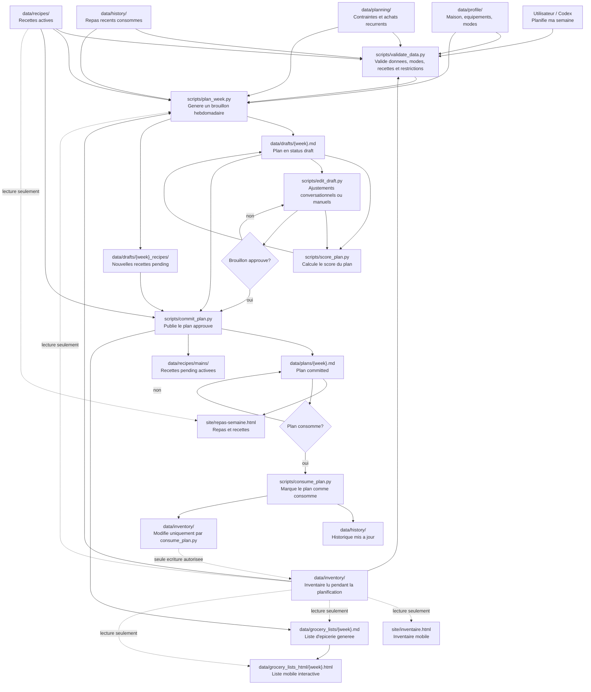

# AI Household Meal Operating System

Systeme local de planification des repas pour une famille de 4 personnes.

Principes:

- Les fichiers Markdown sont la source de verite.
- Les scripts Python orchestrent les lectures, validations et generations.
- Les agents Markdown guident Codex dans les decisions conversationnelles.
- Aucune base de donnees, aucun serveur web et aucune interface graphique en v1.

## Commandes

```powershell
python scripts\validate_data.py
python scripts\plan_week.py
python scripts\edit_draft.py --slot "Jour 3" --side "Salade verte"
python scripts\commit_plan.py
python scripts\generate_grocery_list.py
python scripts\generate_grocery_html.py
python scripts\generate_grocery_html.py --plan data\plans\2026-W26.md --out site\liste-epicerie.html
python scripts\generate_meal_plan_html.py
python scripts\generate_meal_plan_html.py --plan data\plans\2026-W26.md --out site\repas-semaine.html
python scripts\generate_inventory_html.py
python scripts\generate_inventory_html.py --out site\inventaire.html
python scripts\score_plan.py
python scripts\consume_plan.py
```

Par defaut, `plan_week.py` genere un brouillon pour la semaine courante dans `data/drafts/`. Il ne genere pas la liste d'epicerie et n'ajoute pas les nouvelles recettes a la banque active.

Quand le brouillon est approuve, `commit_plan.py` publie le plan dans `data/plans/`, active les recettes nouvelles approuvees dans `data/recipes/mains/`, puis genere la liste d'epicerie dans `data/grocery_lists/`.

Sur demande, `generate_grocery_html.py` genere une version HTML mobile et interactive de la liste d'epicerie dans `data/grocery_lists_html/`.

Sur demande, `generate_meal_plan_html.py` genere une version HTML mobile du plan de repas avec l'agenda de la semaine, les ingredients et les methodes des recettes dans `data/meal_plan_html/`.

Sur demande, `generate_inventory_html.py` genere une version HTML mobile en lecture seule de l'inventaire dans `data/inventory_html/`.

Pour publier les pages sur GitHub Pages, generer les fichiers stables avec:

```powershell
python scripts\generate_grocery_html.py --plan data\plans\2026-W26.md --out site\liste-epicerie.html
python scripts\generate_meal_plan_html.py --plan data\plans\2026-W26.md --out site\repas-semaine.html
python scripts\generate_inventory_html.py --out site\inventaire.html
```

Le workflow GitHub Actions `.github/workflows/pages.yml` regenere et publie `site/liste-epicerie.html`, `site/repas-semaine.html` et `site/inventaire.html` sur GitHub Pages a chaque push vers `master` ou `main`. Les URL attendues sont:

```text
https://<github-user>.github.io/meal-planner-ai/liste-epicerie.html
https://<github-user>.github.io/meal-planner-ai/repas-semaine.html
https://<github-user>.github.io/meal-planner-ai/inventaire.html
```

Les plans utilisent cinq positions flexibles (`Jour 1` a `Jour 5`) plutot que des jours fixes comme lundi a vendredi. L'utilisateur peut ensuite assigner chaque repas au vrai jour qui convient.

Le planificateur privilegie les recettes existantes. Quand la banque le permet, chaque brouillon utilise quatre soupers existants et propose un nouveau souper pending. Si la banque est vide ou insuffisante, il propose le minimum de nouvelles recettes pending pour remplir les cinq soupers.

Chaque plan inclut les lunchs enfants et adultes. Les lunchs enfants sont toujours froids; les lunchs adultes peuvent etre froids ou rechauffes.

## Flux Conversationnel

Quand l'utilisateur demande "Planifie ma semaine", Codex doit:

1. Lire `data/profile/`, `data/inventory/`, `data/planning/`, `data/history/` et `data/recipes/`.
2. Executer `python scripts\validate_data.py`.
3. Executer `python scripts\plan_week.py` pour creer un brouillon.
4. Ajuster le brouillon dans `data/drafts/` jusqu'a approbation.
5. Executer `python scripts\commit_plan.py` pour publier le plan et generer l'epicerie.
6. Si le plan est confirme comme consomme, executer `python scripts\consume_plan.py`.

## Diagramme Du Flux



Version PNG zoomable: [docs/meal-flow.png](docs/meal-flow.png)

## Regle De Maintenance Du Diagramme

Chaque changement fonctionnel doit verifier si le diagramme du flux dans ce README reste exact. Si le changement touche le flux du projet, les responsabilites des scripts, les dossiers d'entree ou de sortie, la regle d'ecriture de l'inventaire, ou le comportement de brouillon, commit, epicerie, score ou consommation, le diagramme doit etre mis a jour dans le meme changement.

Le bloc Mermaid du README est la source de verite du diagramme. Si le bloc change, regenerer aussi `docs/meal-flow.png` avec `python scripts\render_readme_flow_png.py` dans un environnement Python qui contient Pillow.

## Regle Anti-Conflit

Seul `scripts\consume_plan.py` modifie `data\inventory\`. Les agents de planification et d'epicerie lisent l'inventaire, mais ne le changent pas.

## Restrictions Alimentaires

Le profil maison interdit les crustaces. Le poisson et les moules restent permis.

Les recettes actives ne doivent pas utiliser `protein_type: seafood`; elles doivent choisir une classification precise comme `fish`, `mussels` ou `crustacean`.

## Modes Et Saisons

Les modes actifs sont listes dans `data\profile\modes.md`. Seuls `ecole` et `pas_ecole` sont supportes.

La saison est detectee automatiquement: `saison_chaude` pour mai a aout, `saison_froide` pour septembre a avril.
